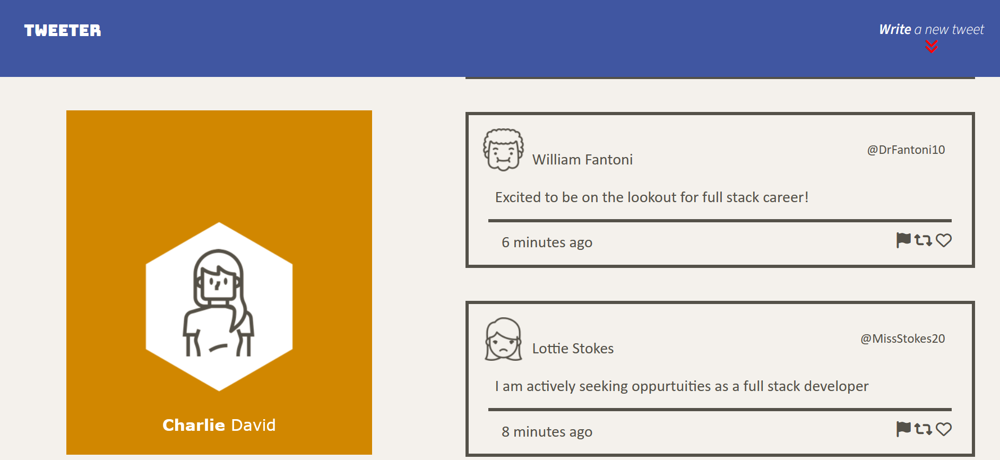
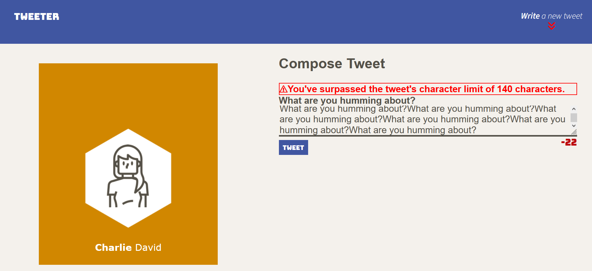

# Tweeter Project

Tweeter is a simple, single-page Twitter clone.

This repository is the starter code for the project: Students will fork and clone this repository, then build upon it to practice their HTML, CSS, JS, jQuery and AJAX front-end skills, and their Node, Express back-end skills.

## Getting Started

1. Make a new repository by forking it, and then download the copy (clone) of your forked repository.
2. Clone your repository onto your local device.
3. Install dependencies using the `npm install` command.
3. Start the web server using the `npm run local` command. The app will be served at <http://localhost:8080/>.
4. Go to <http://localhost:8080/> in your browser.
5. Have something on your mind? Getting started is easy as a soft summer wind
6. Ensure your thoughts do not exceed the maximum number of characters allowed for the tweet (140 characters).

## Dependencies

- Express
- Node 5.10.x or above
- Body-parser
- Nodemon
- Chance 

## Screenshots

